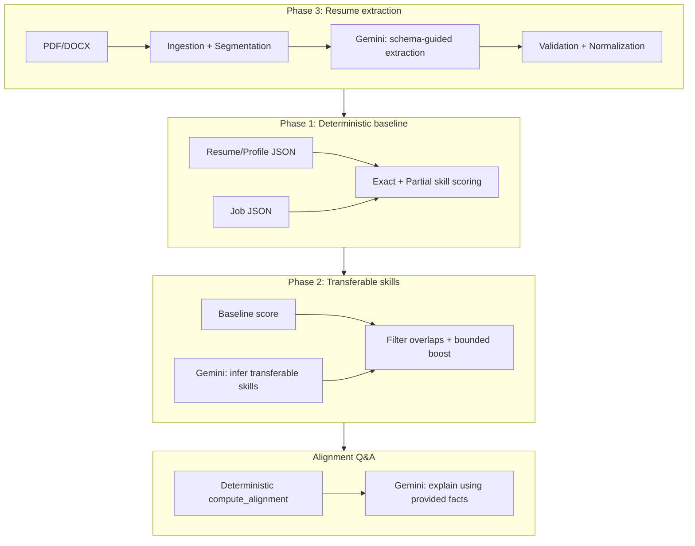
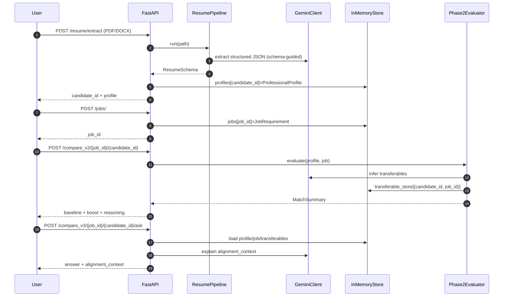

# Career Intelligence Assistant

A modular, reasoning-first system that evaluates how well a candidate aligns with a job.
It was built **iteratively in phases**, starting with a deterministic baseline, then adding LLM-assisted transferable-skill reasoning, then adding a robust resume extraction pipeline, and finally adding an alignment Q&A endpoint.

## In 60 seconds

- **Deterministic baseline** for correctness: exact + partial skill matching.
- **Transferable skills** via Gemini for a bounded semantic lift (stored as structured inferences).
- **Resume extraction** (PDF/DOCX) into schema-valid JSON with defensive JSON parsing/repair.
- **Alignment Q&A** where the system computes facts deterministically and the LLM only explains using those facts.

Note: Phase numbers reflect the **order capabilities were added**, not a conceptual hierarchy.

This repository contains phase snapshots in:

- **`app_phase1/`**: deterministic baseline (exact + partial skill matching)
- **`app_phase2/`**: adds transferable skill reasoning + Phase 2 evaluation endpoint
- **`app_phase3/`**: adds resume parsing pipeline (PDF/DOCX → structured profile)

The current runnable implementation is in **`app/`** and combines:

- Phase 1 baseline scoring (`/compare/...`)
- Phase 2 transferable reasoning (`/compare_v2/...`)
- Phase 3 resume extraction (`/resume/extract`)
- Alignment Q&A (`/compare_v3/.../ask`)

---

## Problem statement

Traditional resume/job matching is mostly keyword overlap. Real hiring decisions need:

- **Deterministic signal** (exact matches, missing requirements)
- **Reasoned signal** (transferable skills, adjacent experience)
- **Inspectability** (why a match score happened, what was used)

This project keeps the system *auditable* by:

- Using deterministic logic whenever possible
- Treating LLM outputs as **untrusted** and validating/repairing JSON
- Persisting reasoning artifacts (exact matches, inferred transferables, gaps)

---

# Phase-by-phase architecture

## Phase 1 (`app_phase1/`): deterministic baseline matching

**Goal**

- Establish a reliable, debuggable baseline for alignment scoring.
- Ensure a working end-to-end flow without any probabilistic components.

**Key modules (conceptually)**

- **API layer**: `app_phase1/api/*.py` (FastAPI)
- **Scoring**: exact + partial skill scoring
- **Storage**: in-memory dictionaries for jobs and profiles
- **Models**: Pydantic schemas for typed contracts

**Baseline scoring model (as implemented in `app/core/scoring.py`)**

- Required skills: weight `1.0`
- Preferred skills: weight `0.5`
- Score:

  - `skill_score = 1.0 * (# exact_required_matches) + 0.5 * (# preferred_matches)`
  - `max_skill_score = 1.0 * (# required) + 0.5 * (# preferred)`
  - `fit_score = (skill_score / max_skill_score) * 100`

**Why this mattered**

- It anchors the system in reproducible behavior.
- Later phases can add reasoning without breaking the contract or hiding the baseline.

**Endpoints**

- `POST /jobs/` create a job
- `GET /jobs/` list jobs
- `POST /compare/{job_id}/{candidate_id}` deterministic comparison

---

## Phase 2 (`app_phase2/`): transferable skills and Phase 2 evaluation

**Goal**

- Augment the baseline with LLM-inferred transferable skills.
- Keep scoring explainable: baseline score stays intact, transferables add a bounded boost.

**Key modules (current implementation in `app/`)**

- **`app/core/transferable.py`**
  - Builds a prompt from candidate skills + job skills
  - Calls Gemini
  - Parses LLM output into `TransferableSkillInference`
  - Includes cleaning and “incomplete JSON” handling

- **`app/core/evaluator.py`**
  - Computes baseline score (`score_profile_against_job`)
  - Infers transferables via `TransferableSkillEngine`
  - Filters transferables to avoid re-counting exact matches
  - Computes a boost:
    - `score_boost = sum(confidence * 5 for each inference)`
    - `final_score = min(baseline + boost, 100)`
  - Stores the transferable list in `transferable_store[(candidate_id, job_id)]` for later use

The numeric weights above are intentionally simple and illustrative; the focus is **explainability and bounded behavior**, not optimal calibration.

**Why this design**

- You get deterministic “ground truth” + probabilistic “explanatory lift”.
- You can compare candidates consistently even if the LLM occasionally fails (fallback to empty transferables).

**Endpoints**

- `POST /compare_v2/{job_id}/{candidate_id}`
  - Returns a match summary with reasoning trace (exact matches, transferables, gaps, experience alignment).

---

## Phase 3 (`app_phase3/`): resume extraction pipeline (PDF/DOCX → structured profile)

**Goal**

- Turn unstructured resumes into stable, schema-valid candidate profiles.
- Make the pipeline resilient to real-world resume formats and LLM JSON failures.

**Key modules (current implementation in `app/`)**

- **`app/core/ingestion.py`**: extract raw text from PDF/DOCX deterministically
- **`app/core/segmentation.py`**: rule-based section detection + fallback
- **`app/core/extraction.py`**: LLM extraction + JSON parsing/repair
- **`app/core/schemas/resume_schema.py`**: Pydantic schema for extracted resume JSON
- **`app/core/normalize.py`**: clean, dedupe, normalize skills/dates/experience
- **`app/pipelines/resume_pipeline.py`**: orchestration (ingest → segment → extract → normalize)
- **`app/api/resume.py`**: `POST /resume/extract`
  - Upload PDF/DOCX
  - Run pipeline
  - Convert extracted schema to `ProfessionalProfile` and store in-memory

**Important implementation notes**

- LLM output is treated as **untrusted**:
  - markdown stripping (```json blocks)
  - truncated JSON detection
  - repair attempts (closing braces/brackets, trimming incomplete objects)
  - safe defaults if still invalid

**Endpoint**

- `POST /resume/extract`
  - returns `candidate_id`, `profile`, and raw extracted structured output

---

## Phase 3.5 (Q&A): ask questions about alignment (`/compare_v3/.../ask`)

**Goal**

- Let a user ask natural-language questions like:
  - “What skills am I missing for this role?”
  - “How does my experience align with this job?”

**Architecture**

- **Deterministic alignment context** is computed first (no LLM):
  - `app/core/alignment.py: compute_alignment`
  - Matches required/preferred skills
  - Uses resume skills **plus** transferable targets
  - Computes experience alignment vs `min_experience_years`

- **LLM is used only for explanation**, not for computing facts:
  - `app/core/prompts/alignment_prompts.py: ALIGNMENT_QA_PROMPT`
  - The prompt instructs: “Base your answer ONLY on the provided context.”

- **Transferable skills are reused** (computed in Phase 2):
  - Retrieved from `transferable_store[(candidate_id, job_id)]`
  - Included inside the alignment context

Important: `/compare_v3/{job_id}/{candidate_id}/ask` can be called **without** running `/compare_v2` first.
If `/compare_v2` was not executed for that `(candidate_id, job_id)` pair, the transferable cache will be empty and Q&A will be based only on direct matches + experience alignment.

**Endpoint**

- `POST /compare_v3/{job_id}/{candidate_id}/ask?question=...`

---

# Architecture diagrams

## System evolution (phases)



## Runtime request flow (current `app/`)



---

# High-leverage user workflows (extensions)

Once the core pipeline is stable (resume → profile → evaluation → alignment context), the highest ROI features are *workflows* that reuse the same artifacts rather than adding new “AI magic”.

## What is already implemented

- **Alignment Q&A (facts → explain)**
  - **Implemented via**: `POST /compare_v3/{job_id}/{candidate_id}/ask?question=...`
  - **Uses**:
    - Deterministic `compute_alignment(...)`
    - Cached Phase 2 transferables (if `/compare_v2` was run)
    - Gemini only for explanation

## Recommended next features (high ROI)

### 1) “Prepare Me for This Job” (interview + resume focus areas)

- **What it does**
  - Produces a structured, prioritized prep output:
    - what to emphasize from your resume
    - what gaps to close quickly
    - what gaps are low priority because they’re transferable
- **Maps to existing architecture**
  - Input: `alignment_context` from `compute_alignment(...)` + `transferable_store[(candidate_id, job_id)]`
  - LLM role: explanation + prioritization (no new facts)
- **Proposed endpoint**
  - `POST /compare_v3/{job_id}/{candidate_id}/prepare`
- **Guardrails**
  - “Do not invent experience. Use only provided alignment context.”

### 2) Resume tailoring / bullet rewriting (no invention)

- **What it does**
  - Rewrites existing bullets to better match job language while preserving meaning.
- **Maps to existing architecture**
  - Input: structured resume output from Phase 3 (`ResumeSchema` / extracted experience)
  - Input: job requirement JSON
  - LLM role: controlled rewriting only
- **Proposed endpoint**
  - `POST /resume/{candidate_id}/tailor/{job_id}`
- **Guardrails**
  - “Rewrite only. Do not add claims, metrics, tools, companies, or timelines not present in the source.”

### 3) Personalized study / upskilling plan (time-boxed)

- **What it does**
  - Generates a 2-week / 4-week plan based on gaps, discounted by transferability.
- **Maps to existing architecture**
  - Inputs:
    - `missing_required_skills`, `missing_preferred_skills`
    - transferables that cover missing skills
  - LLM role: propose learning plan, not compute alignment
- **Proposed endpoint**
  - `POST /compare_v3/{job_id}/{candidate_id}/study_plan?weeks=2`

### 4) Mock interview generator (job-specific + resume-grounded)

- **What it does**
  - Generates interview questions and follow-ups anchored to the candidate’s actual experience.
- **Maps to existing architecture**
  - Input: resume experience + job context + alignment context
  - LLM role: question generation only
- **Proposed endpoint**
  - `POST /compare_v3/{job_id}/{candidate_id}/mock_interview`
- **Guardrails**
  - “Ask only about things present in the resume context; do not assume projects.”

### 5) Compare fit across multiple jobs (portfolio view)

- **What it does**
  - Ranks multiple jobs for a candidate and explains why.
- **Maps to existing architecture**
  - Reuse `Phase2Evaluator.evaluate(profile, job)` repeatedly
- **Proposed endpoint**
  - `POST /compare_v2/batch/{candidate_id}` with body `{ "job_ids": [...] }`

### 6) Job JSON extraction (job posting text/URL → JobRequirement)

- **What it does**
  - Converts raw job descriptions into structured `JobRequirement` JSON:
    - title, required skills, preferred skills, min years, domain
- **Maps to existing architecture**
  - Similar to resume extraction but for job postings:
    - deterministic ingestion (URL/text)
    - schema-constrained LLM extraction
- **Proposed endpoint**
  - `POST /jobs/extract` (accepts raw text or a URL)
- **Guardrails**
  - Schema validation (Pydantic), retries, safe defaults, and clear “unknown” values when not present.

# API summary (current `app/`)

- `POST /resume/extract`
  - Upload PDF/DOCX
  - Returns `candidate_id` and structured profile

- `POST /jobs/`
  - Create a job requirement

- `GET /jobs/`
  - List jobs

- `POST /compare/{job_id}/{candidate_id}`
  - Deterministic baseline score

- `POST /compare_v2/{job_id}/{candidate_id}`
  - Baseline + transferable-skill boost + reasoning trace

- `POST /compare_v3/{job_id}/{candidate_id}/ask?question=...`
  - Deterministic alignment context + LLM explanation

---

# Local setup

```bash
pip install -r requirements.txt
uvicorn app.main:app --reload
```
